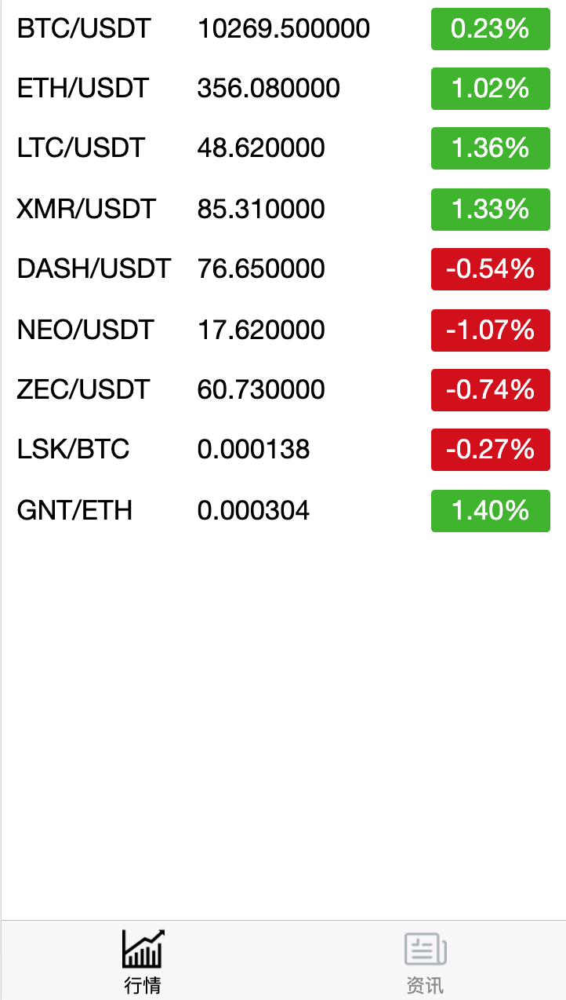
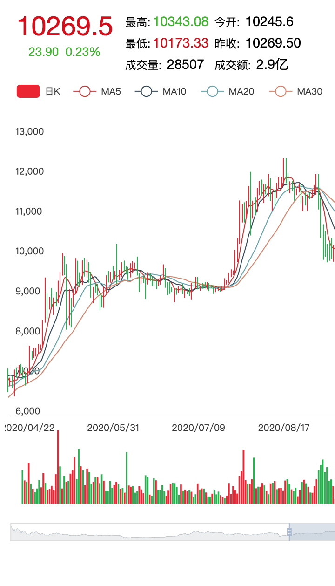
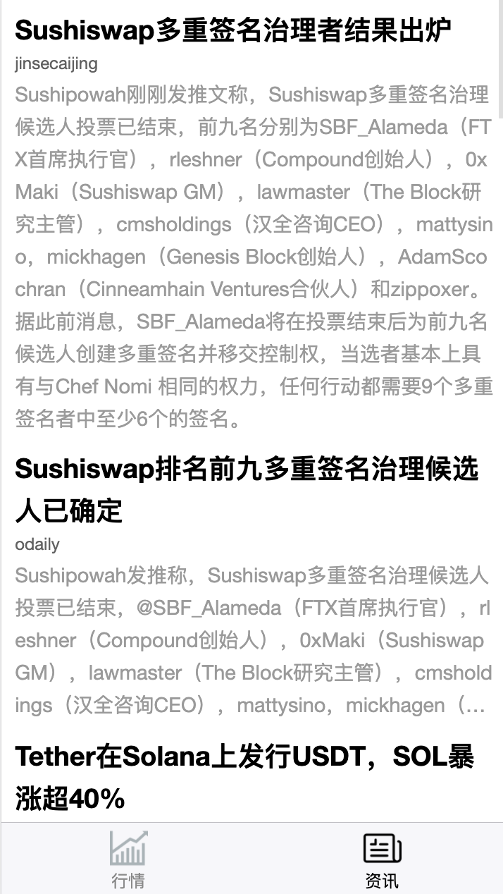

# flutter_posy

A crypto market tracking wechat app built with Taro、TypeScript and ccxt
  <table><tr>
   <td style="text-align: center">
    
  </td>
  <td style="text-align: center">
    
  </td>
    <td style="text-align: center">
    
  </td>
 
</tr></table>